Developer - **Chandan Patel**

# Introduction

Guided by the expertise of Dr. Timothy Smith, this application embarks on a
transformative journey to redefine educational engagement within the MS
BAIS program at the University of South Florida’s Muma College of
Business. In alignment with contemporary digital transformation trends
in education, our initiative is meticulously designed to enhance and
simplify the student admission journey from the initial inquiry to
successful enrollment. Utilizing advanced text analytics, we have
integrated Generative AI-based applications—a strategic melding of
technological innovation and user-centric design principles, aimed at
improving interaction quality, response efficiency, and overall service
satisfaction within the MS BAIS program.

# Executive Summary

## Objective

- Undertake the development and implementation of a Generative AI-based
  interface to enhance the MS BAIS program at USF, aiming to facilitate
  a seamless and supportive academic journey for students from the
  initial stages of program selection to application and onboarding.

## Findings

- **System Utilization:** USF predominantly utilizes the Jira system for
  managing and tracking student queries within the MS BAIS program.

- **Assistance Approach:** Despite the availability of comprehensive
  information on the graduate course website, there is a discernible
  need for more direct and clear student assistance.

  - **Admission Process:** The prevailing admission process, although
    thorough, lacks user-friendly interactive components.

  - **Student Interaction Tools:** A noticeable gap exists due to the
    lack of an interactive chatbot, resulting in a reliance on
    traditional, less efficient query resolution methods.

  - **Information Accessibility:** The FAQ page is identified as a
    crucial resource, underscoring the importance of clear and readily
    accessible program information.

## Recommendations

- **Enhanced Data Collection:** Advocate for a systematic approach to
  collecting and analyzing data from common student inquiries and
  historical interactions to enhance the automated capabilities of the
  new digital interface.

- **CHATBOT Application Deployment:** Recommend introducing a dynamic
  Chatbot application on the MS BAIS website to dynamically address
  FAQs, facilitate the application process, and optimize administrative
  workflows.

- **Pre-requisite check for Courses application**

## Business Process Analysis

1\. Detailing the Existing MS BAIS Business Process Landscape

- System Utilization: The MS BAIS program at USF heavily relies on the
  Jira system for managing student inquiries, which predominantly
  functions as a tracking rather than a resolution tool, highlighting an
  area for improvement in query resolution capabilities.

- Assistance Dynamics: Despite having a substantial presence on USF's
  graduate website, the MS BAIS program often encounters direct student
  inquiries for clarifications or additional information, suggesting
  existing gaps or areas of improvement in information clarity and
  accessibility.

- Enrollment Paradigm: The admission process, although systematic and
  organized, involves multiple stages that present opportunities for
  streamlining to enhance the overall user experience and simplify the
  admission process.

2\. Identifying Bottlenecks

- Reliance on Manual Channels: There’s a notable tendency for students
  to seek direct, manual interactions, which suggests an opportunity to
  enhance the effectiveness and user-friendliness of online information.

- Absence of Automated Support: A significant observed gap is the lack
  of automated tools like chatbots, resulting in slower response times
  and an increased workload for administrative staff.

- Over-reliance on JIRA: While JIRA is effective, its exclusive use for
  managing all student inquiries might result in potential backlogs and
  delayed responses, particularly during peak admission periods.

3\. Exploring Areas Where a Generative AI-based Application Like CHATBOT
Could Add Value

- Immediate Assistance: The introduction of a Generative AI-based
  CHATBOT application aims to provide immediate, responsive support,
  improving both student satisfaction and administrative efficiency.

- Reducing Workload: Automation of routine responses through the
  application could significantly alleviate the administrative workload,
  thereby enhancing operational efficiency.

- Optimizing Admission Funnel: The application could provide
  interactive, guided support during the application process,
  facilitating a smoother and more intuitive application process.

- Bridging Information Gaps: A dynamic chat interface, such as the
  proposed Generative AI-based application, could offer adaptive,
  customized responses to user inquiries, helping overcome the
  limitations of static webpage information and guiding users more
  effectively to relevant resources.

# Data Assessment

- Utilization of Data Sources: A strategic blend of data sources has
  been curated to develop a responsive and insightful CHATBOT system.

- Available Data Sources:

  - Manual extraction and web scraping from the USF graduate course
    website.

  - Integration of feature-engineered data from Jira tickets and the
    website into the knowledge base.

# Phase 1: Knowledge Database Design 

## Data Source Identification and Extraction:

In this crucial phase, we meticulously identified and gathered data from
diverse sources to create a robust knowledge base for the MS BAIS
Program. Our approach was comprehensive, covering both web-based
resources and valuable conversation records:

- **Jira Ticket Details:**

  - Variables such as "Summary," "Status," "Created (date)," and
    "Description" are pivotal for the chatbot’s training.

  - These details will be used to develop NLP models that can discern
    user intent and respond appropriately.

- **USF Graduate Course Website Content:** A hybrid approach was
  employed for data collection:

  - **Manual Extraction:** Certain sections of the website were manually
    reviewed to ensure accurate and contextually relevant information
    capture.

  - **Web Scraping:** Automated scraping tools were used to collect
    frequently updated content, such as FAQs and program updates.

This dual method guarantees a comprehensive dataset for the chatbot’s
knowledge base.

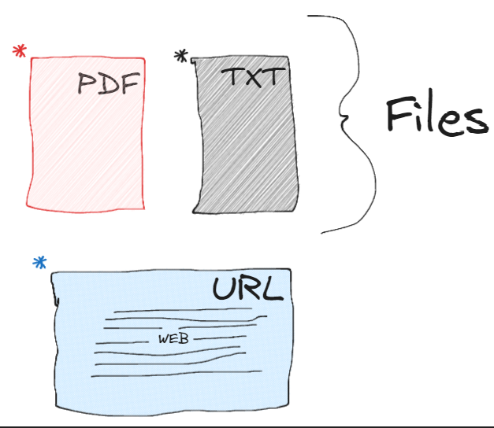

*Source: Google Image search*

*Figure 1*

## Data Extraction from MS BAIS Graduate Webpage and Catalog: Web Scraping and Manual Collection

Our initial data source entailed extracting information directly from
the official MS BAIS graduate webpage and catalog. We approached this
task using two methods:

- **Web Scraping:**

We employed web scraping techniques to automatically gather data from
the website, capturing details such as program information, admission
procedures, course costs, contact details, and frequently asked
questions.

- **Manual Data Extraction:**

Alongside web scraping, we also manually collected data from the website
to ensure no critical information was overlooked. This included all
relevant documents like admission processes, application guides,
curriculum requirements, and more.

The combined efforts of web scraping and manual extraction resulted in a
comprehensive dataset of essential documents, all formatted as PDFs,
which included:

1.  doc1\_ overall admission process of MS BAIS.pdf

2.  doc2_how to apply for MS BAIS.pdf

3.  doc3_MS BAIS Admission.pdf

4.  doc4_cost of MS BAIS course.pdf

5.  doc5_contact freshman admissions.pdf

6.  doc6_MS BAIS application.pdf

7.  doc7_explore graduate programs.pdf

8.  doc8_what is I20.pdf

9.  doc9_most frequently asked questions.pdf

10. doc10_additional information.pdf

11. doc11_graduate assistantships.pdf

12. doc12_MS BAIS Curriculum.pdf

13. doc13_MS BAIS curriculum requirements.pdf

14. doc14_MS BAIS prerequisites courses for incoming students.pdf

15. doc15_global executive program (full time, 100 per online.pdf

16. doc16_getting started with MS BAIS_new student checklist.pdf

## Conversation Records between Students and College Management via Jira Ticketing:

We also leveraged conversation records between students and college
management obtained from the Jira Ticketing system. These conversations,
formatted in JSON, underwent the following processing steps:

- **Cleaning PII Data:** Ensuring privacy and security, we meticulously
  employed regular expressions (regex) to methodically identify and
  expunge personally identifiable information (PII) and unnecessary
  special characters from the conversation datasets.

- **Data Labeling:** To enhance readability and maintain an organized
  structure, we performed key renaming. This involved changing keys like
  "Query 1" and "Response 1" to more intuitive labels, such as "Student
  Conversation 1," closely aligned with conversation numbers.

**File Format Conversion**: To ensure compatibility with our knowledge
base, we converted the cleaned JSON records into the PDF file format,
facilitating easier integration through our document loader.

The resulting dataset represented as “doc17_Conversation Records between
Students and College Management.pdf” became an invaluable resource for
our knowledge base.

## Inclusion of Syllabus PDFs for Coursework and Faculty Reference

**Syllabus Collection:**

As an extension of our document collection process, we have integrated
detailed syllabus PDFs for each course offered in the MS BAIS program.
This inclusion serves a dual purpose:

- **Coursework Verification:** Students or administrators wishing to
  verify specific coursework can refer to these documents to check for
  course content, structure, and requirements.

- **Faculty Information:** For those interested in understanding the
  teaching methodologies or researching faculty credentials, these
  syllabi provide a window into the academic environment of the MS BAIS
  program.

The syllabus documents include:

- Course outlines

- Weekly topics

- Grading criteria

- Textbook requirements

- Contact hours

- Instructor bios and contact information.

This comprehensive syllabus dataset ensures transparency and provides
prospective and current students, as well as faculty members, with
detailed insights into the academic offerings of the MS BAIS program.

## Data Schema Development: 

A crucial aspect of our knowledge base project involved defining a
well-structured data schema. To achieve this, we employed Pinecone DB as
our vector database and the Langchain Text Splitter known as
RecursiveCharacter Text Splitter for data segmentation:

- Pinecone DB for Vector Database: We recognized the power and
  efficiency of Pinecone DB for managing our vector data. Pinecone DB
  operates as a 'key-value' store, where the 'key' corresponds to the
  embedding vector, and the 'value' represents the original text data.

- RecursiveCharacter Text Splitter: For effective data segmentation and
  structuring, we adopted the RecursiveCharacter Text Splitter. This
  tool enabled us to break down our data into manageable 'chunks,'
  ensuring optimal organization within the knowledge base.

The careful selection of these tools laid the groundwork for our data
schema, setting the stage for efficient vectorization and retrieval
processes.

## Vectorization Techniques:

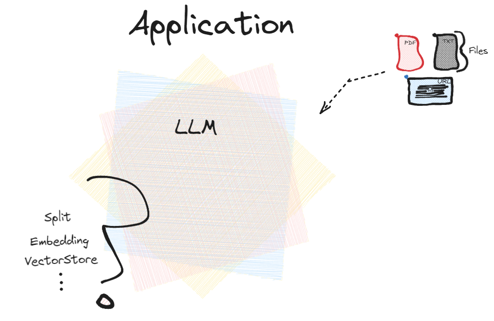

*Figure 2*

- **Embedding Fundamentals & Data Chunks**

> Embedding is a transformative technique that encodes textual
> information into a numerical array, thus facilitating machine
> comprehension. Complex datasets are compartmentalized into manageable
> 'chunks', streamlining algorithmic processing.

- **Strategic Application of Vectorization**

> Our initiative utilizes OpenAI's Ada document embedding API, known as
> "text-ada-002," acclaimed for its deep learning prowess in decoding
> intricate language constructs. Our selection was driven by Ada's
> superior semantic interpretive abilities and its aptitude for
> contextual relevance, crucial for the nuanced dialog our chatbot
> engages in.

- **Comparative Vectorization Analysis**

> In our thorough evaluation, we considered TF-IDF, One-Hot Encoding,
> and Word2Vec. Yet, Ada's embedding solution emerged as the leading
> approach, marrying reduced dimensionality with comprehensive semantic
> acuity.

- **Ada's Methodological Supremacy**

> Ada's framework excels beyond TF-IDF and One-Hot Encoding with its
> depth of semantic analysis. While Word2Vec offers robust vector
> representations, Ada's contextual discernment is unmatched,
> solidifying its status as our vectorization method of choice.

- **Conclusion**

> Ada's embedding API is the cornerstone of our CHATBOT application,
> chosen for its all-encompassing deep learning approach and seamless
> embedding process. This core technology guarantees that our chatbot's
> responses are both precise and contextually relevant, underscoring our
> dedication to crafting a state-of-the-art CHATBOT resource for the MS
> BAIS Program at USF.

## 

# Phase 2: Pinecone Vector Database Implementation

- Data Consolidation and Verification: We've reassessed and verified the
  data collected in Phase 1, ensuring a solid foundation for the
  Generative AI interface. The dataset is now complete, accurate, and
  ready for further processing.

- Data Preparation and Segmentation: The data has been preprocessed to
  align with our established schema. We've standardized text data,
  removed extraneous details, and segmented the data, making it ready
  for vectorization.

- Vectorization Leveraging OpenAI Ada: Using OpenAI Ada's document
  embedding API, we've transformed the clean data into machine-readable
  vectors. This step is crucial for maintaining semantic integrity,
  enabling the chatbot to provide context-aware responses.

- Pinecone Database Deployment**:** We’ve deployed a vector database
  using Pinecone, notable for its swift data retrieval capabilities.
  This database is key to managing vectorized data efficiently.

- Database Efficacy Testing: Extensive testing has been undertaken to
  refine the database's performance. We’ve validated the accuracy and
  speed of the chatbot's responses, ensuring that every data vector is
  effectively enhancing user interaction.

- Visualization of the Operational Index: A screenshot of the
  "ms-bais-ta-project-index" Pinecone vector database index is presented
  as concrete proof of our system's operational capability. This visual
  documentation showcases the active environment and vector metrics,
  underscoring our system’s readiness for deployment.

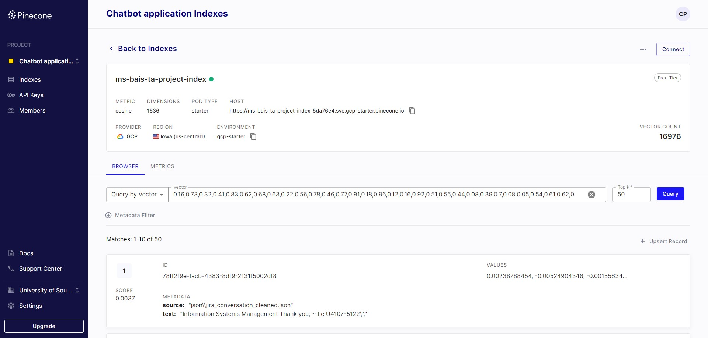

Figure 3

# Technical Architecture

The TalkTech Tinkerers team has ingeniously constructed a sophisticated
yet optimized blueprint for the MS BAIS chatbot system. Here's a
comprehensive overview of this thoughtfully engineered technical
architecture.

## Overall Architecture of the Chatbot

### Data Flow Diagrams

- **User**: The user interacts with the chatbot, posing questions or
  providing input.

- **Input Interface**: This component captures the user's input. It
  could be a text box on a website, a mobile app interface, a voice
  recognition system, or any other interface through which users
  communicate with the chatbot.

- **Chat History Memory**: This module keeps a record of the
  conversation's context, including previous interactions. Storing the
  history is crucial for context-aware responses. For instance, if the
  user previously mentioned a topic and refers to it later with a
  pronoun like "it", the chatbot can reference the history to understand
  the context.

- **Pre-Processing**: This step involves cleaning and formatting the
  user's input. Common tasks might include converting all text to
  lowercase, removing special characters, and expanding contractions
  (e.g., "it's" to "it is").

- **LangChain API (for translation, if needed)**: If the chatbot is
  designed to work in multiple languages, this step translates the
  user's input into a standard language (typically English). LangChain
  is a placeholder name for a translation service.

- **Query Augmentation (Prompt creation)**: Here, the user's query is
  enhanced or reformulated to be better understood by the model. For
  instance, a user's question like "capital of France?" might be
  augmented to "What is the capital of France?"

- **Vector Store Lookup**: If the chatbot uses embeddings (vector
  representations of text), this step fetches any relevant embeddings
  related to the user's query. This could be useful for quickly
  retrieving known answers or related content.

- **OpenAI API Call (LLM or any relevant model)**: This is the core
  processing step where the user's query (or the augmented version of
  it) is sent to an AI model, like OpenAI's LLM, to generate a response.

- **Post-Processing**: After receiving the model's response, this step
  fine-tunes the output. It might involve correcting grammar, ensuring
  the response length is suitable, or other refinements.

- **Output Interface**: This is the component that presents the
  chatbot's response to the user. Just as with the Input Interface, this
  could be a text box on a website, a voice output in a voice assistant,
  etc.

- **User**: The final response is delivered to the user, who can then
  continue the conversation or end it.

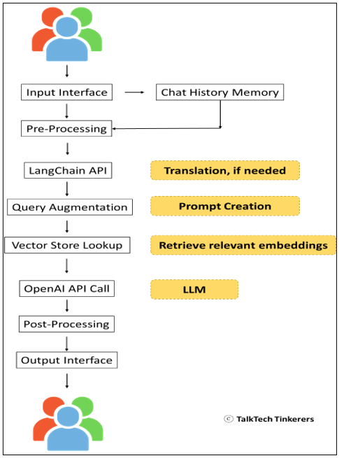

Figure 4: Data Flow Diagrams

### All Stages of BullBot functionality:

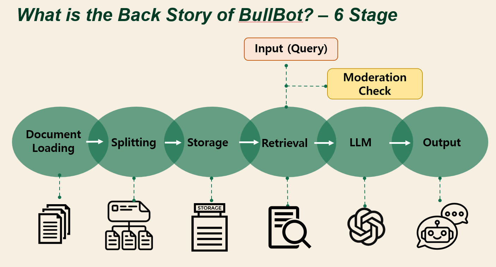

Figure 5: sequential process flow Diagrams

1.  Input (Query): The user initiates the process by inputting a query
    into the system.

2.  Moderation Check: Immediately after receiving the query, BullBot
    performs a moderation check. This step is crucial for filtering out
    inappropriate or irrelevant queries and ensuring that only valid
    requests are processed further. This check can involve filtering out
    profanity, spam, or queries that don't align with the system's
    capabilities or content policies.

3.  Document Loading: The system loads relevant documents from its
    database, which serve as the knowledge base for answering queries.

4.  Splitting: BullBot then splits the loaded documents into smaller,
    manageable sections. This might involve parsing the documents into
    paragraphs or other logical units, making it easier to find specific
    information later on.

5.  Storage: The split information is stored in a structured way, likely
    indexed to allow for quick retrieval. This organization is key for
    efficient operation and timely responses.

6.  Retrieval: When a user query passes the moderation check, BullBot
    retrieves the relevant information from its storage. The system uses
    search algorithms to find the most appropriate data to answer the
    query.

7.  LLM (Language Learning Model): The retrieved data is processed by a
    language model that understands natural language. This model is
    responsible for generating an accurate and contextually relevant
    response based on the user's query.

8.  Output: Finally, BullBot provides the output to the user, which is
    the information they requested or a response to their query.

This flow ensures that BullBot only processes queries that are suitable
for the system, which helps maintain the integrity and reliability of
the responses provided. The moderation checks as an upfront filter aids
in maintaining a user-friendly and safe environment for interactions
with the chatbot.

### Component diagrams 

- **Chatbot App:** This is the main application that the user interacts
  with. It's a high-level container that houses several integral
  modules.

  - **Input Interface:** This is the front-end component where users
    input their queries, whether via text, voice, or other means.

  - **Chat History:** This module maintains a record of previous
    interactions between the user and the chatbot. Storing this history
    allows the chatbot to provide contextually relevant responses.

  - **Pre-Processor:** Before the main processing of the user's input,
    this module makes preliminary transformations to the data. Tasks can
    include normalizing text (e.g., converting all to lowercase) or
    removing unnecessary characters.

  - **Query Augmentation:** If the raw user input might be too vague for
    the AI model, this step can modify or extend it. For instance,
    turning "capital France?" into "What is the capital of France?"

  - **Post-Processor:** After obtaining a response from the AI model,
    this module refines the answer. It can correct grammar, adjust the
    tone, or make other necessary changes to make the response more
    user-friendly.

  - **Output Interface:** This is the front-end component that displays
    or voices out the chatbot's response to the user.

- **LangChain API:** Positioned beneath the main Chatbot App, this
  component is responsible for translating user queries if they're in a
  different language. When a user inputs a query in, say, Spanish, the
  LangChain API translates it to English (or another standard language)
  so that the main processing components understand it.

- **Vector Store:** If the chatbot system is designed to use vector
  embeddings (numeric representations of text data), then this module is
  tasked with fetching the relevant embeddings for a given input. These
  embeddings can be instrumental in rapidly retrieving pertinent
  information or determining context.

- **OpenAI API:** This is the core processing engine. Once the user's
  query has been processed and potentially augmented by the modules in
  the Chatbot App, it is sent to the OpenAI API. Here, sophisticated
  models like GPT-4 analyze the query and generate a suitable response,
  which is then sent back up to the Chatbot App for post-processing and
  eventual display to the user.

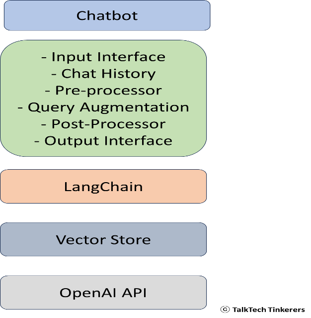

*Figure 6*

### Integration of Various Functionalities for a for Chatbot 

This section describes the cohesive integration of Streamlit, OpenAI,
Pinecone, and LangChain to develop a sophisticated chatbot application.

**Streamlit Interface Setup**

Utilizing Streamlit, we create a user-friendly web application. The
load_css function allows for custom styling, ensuring the interface is
both engaging and functional.

**Pinecone Vector Store Initialization**

The Pinecone vector store is initialized to manage and retrieve document
embeddings, enabling the bot to perform accurate similarity searches.

**Chat Functionality with OpenAI and LangChain**

Integrating OpenAI's GPT-4 with LangChain enhances the chatbot's
conversational abilities, allowing for dynamic and context-aware
interactions.

**Handling PDF Documents**

The chatbot application enables PDF uploads, from which text is
extracted and analyzed for content relevancy.

**Moderation Check:**

The designed application offers a seamless method for students to
determine their eligibility for specific courses in the MS BAIS program.
Through a step-by-step process, students choose a course, provide
evidence of prior experience or education, and receive results from the
LLM model. The model uses a generated prompt and its expansive knowledge
to gauge if the student's background aligns with the pre-requisites of
the MS BAIS program. Through this approach, students can make informed
decisions about their academic journey, ensuring they possess the
foundational knowledge needed for their desired courses.

**BullBot Chat App**

The on_click_callback function underpins the chatbot's interactive
capabilities, processing inputs and generating contextually appropriate
responses.

**Conversational Memory and Debugging**

Conversational memory ensures the continuity of the chat, while
debugging tools provide transparency into the bot's decision-making
processes.

**Interactive Chat Input**

The user interacts with the chatbot through a text input field, with the
chat dynamically evolving with each query.

**Streamlit UI Components:**

Our application's user interface prominently features the USF Muma
College of Business logo at the top, providing users with immediate
brand recognition and a professional aesthetic. This is achieved by
loading the image from a static directory and using Streamlit's image
display capabilities, as shown in the code snippet below:

To facilitate the interactive elements of the chatbot, we create
dedicated containers within the Streamlit app. These containers serve as
placeholders for the chat history, user input prompts, and debugging
information, ensuring that each element is neatly organized and easily
accessible:

These containers are essential for managing the flow of information on
the user interface and allowing for a seamless and interactive user
experience.

## The Integrated Workflow of Bullbot with Visual Guide:

At the forefront of chatbot innovation is an intricate fusion of diverse
technologies and methodologies. Before delving deeper into the
mechanics, let's first gain a panoramic perspective of the entire
procedure. The schema presented below provides this macro view,
highlighting the pivotal phases:

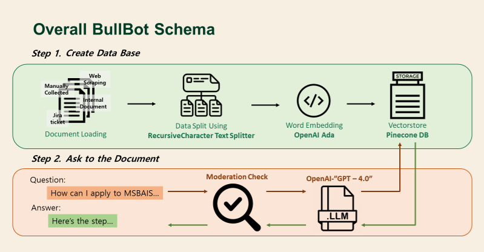

*Figure 7:Overall Bullbot Schema*

- **Step 1 - Create DataBase:**

<!-- -->

- **Data Sourcing:** Various sources, from PDFs and TXT files to URLs,
  are introduced into the system.

- **Data Processing:** The data undergoes segmentation, determining its
  'split type' for optimal embedding.

- **Embedding Selection:** Depending on the data's nature, an apt
  embedding technique is chosen.

- **Vector Storage:** Through the VectorStore system, these embeddings
  are translated into vectors and stored in an organized fashion.

<!-- -->

- **Step 2 - Query Processing**

<!-- -->

- **User Interaction:** Everything starts with a question or statement
  from the user, moderation check filter, prompting a chatbot
  interaction.

- **LangChain Interpretation:** To make sense of the user's input,
  LangChain jumps in. It converts raw data into a structured format,
  prepping it for the next stage.

- **OpenAI Cognition:** The structured query is then relayed to the
  OpenAI API. Here, years of training and vast datasets enable the
  system to generate an informed response.

- **Chatbot's Reply:** The final step sees the crafted response from
  OpenAI returned to the user, completing one full interaction cycle.

# User Interface Design

## Wireframes or Mock-ups

Our design process begins with wireframes and mock-ups that serve as the
blueprint for the USFConnect App’s user interface. These preliminary
visuals allow us to iterate rapidly and align on the design vision
before development begins.

- **Interface Launch:** Upon starting the USFConnect App, users are
  greeted by a clean and professional header featuring the USF Muma
  College of Business logo. This establishes brand identity and sets a
  tone of academic seriousness.

- **View Title:** The title "USFConnect App: Your MS-BAIS Guide" is
  prominently displayed, clearly indicating the app's purpose and
  reassuring users they are in the correct place to find information
  about their MS-BAIS program.

- **Pre-requisite Check Dropdown:** An essential feature highlighted in
  our mock-ups is the Prerequisite Check Dropdown. This interactive
  element invites users to select their program to review necessary
  pre-requisites, simplifying the enrollment preparation process.

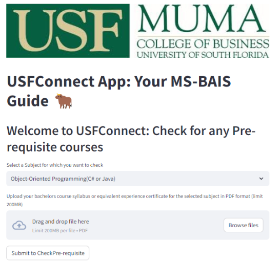

*Figure 7a- Pre-requisite Check App*

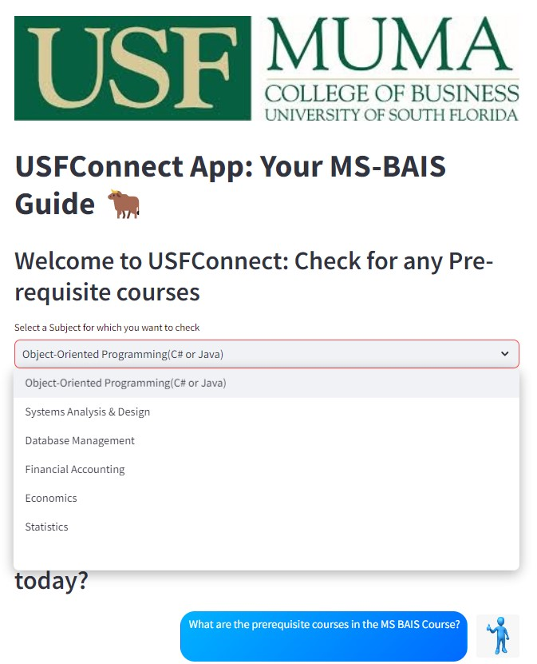

*Figure 7b- Prerequisite Check Dropdown Interface*

The above figure illustrates the Prerequisite Check Dropdown feature of
the USFConnect App, where students can select subjects to confirm their
eligibility for the MS-BAIS program. The interface is crafted for ease,
enabling a straightforward selection process and subsequent document
upload for verification, exemplifying the app's commitment to a
streamlined user experience.

- **Document Upload Section & Submit Button:** Adjacent to the dropdown,
  the Document Upload Section is intuitively designed for ease of use,
  allowing users to upload their syllabi or certification documents. The
  accompanying 'Submit' button is visible, encouraging users to proceed
  with their verification.

- **Chatbot Prompt:** Below the document upload section, the Chatbot
  Prompt introduces our interactive USFConnect BullBot. This AI
  companion engages users with a friendly "How can I assist you today?",
  prompting them to ask questions conversationally.

- **Chat Input Field & Submit Button:** The Chat Input Field is where
  users can type their questions to the BullBot. The field is
  complemented by a distinct 'Go Bulls!' button, which stands out to
  encourage interaction and query submission.

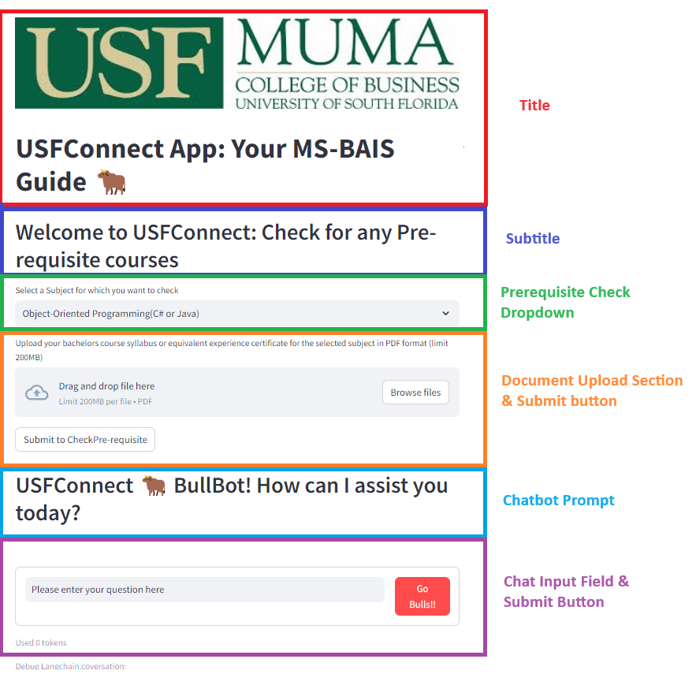*Figure
8- Wireframe*

This figure provides a wireframe of the USFConnect App interface,
highlighting the header with the app title, a section for prerequisite
course checks, the document upload functionality, and the chatbot
interaction area with input fields for user queries.

## User experience flow (Figure 9)

The user experience flow is designed to be intuitive and logical,
allowing students to easily navigate through the app’s features:

- **Interface Launch:** Users start their journey by launching the app,
  where they are welcomed by the interface.

<!-- -->

- **View Title:** The clear title informs the user of the app's purpose.

- **View Chat History:** Users can view previous interactions, providing
  context for ongoing conversations.

- **Question Input:** Here, users can input their queries, contributing
  to a dynamic dialogue with the BullBot.

- **Click Submit:** With a click, users submit their questions,
  activating the BullBot’s response mechanisms.

- **Display AI Response:** The BullBot promptly displays answers,
  ensuring a smooth information exchange.

- **Input Additional Questions:** Users are encouraged to continue the
  conversation by asking additional questions as needed.

## Student Experience Highlights

The USFConnect Chatbot is not merely an information tool; it is designed
to be a companion for students throughout their academic journey at USF:

- **Intuitive Interaction:** The Chatbot mimics natural conversation,
  making students feel like they are interacting with a human advisor.

- **Efficient Information Retrieval:** With intelligent design and
  backend integration, the app quickly retrieves and provides relevant
  information.

- **Engaging User Interface:** The visually appealing and
  easy-to-navigate interface ensures an enjoyable experience for users.

- **Continuous Support:** Students can interact with the BullBot as
  often as needed, providing them with a sense of ongoing support.

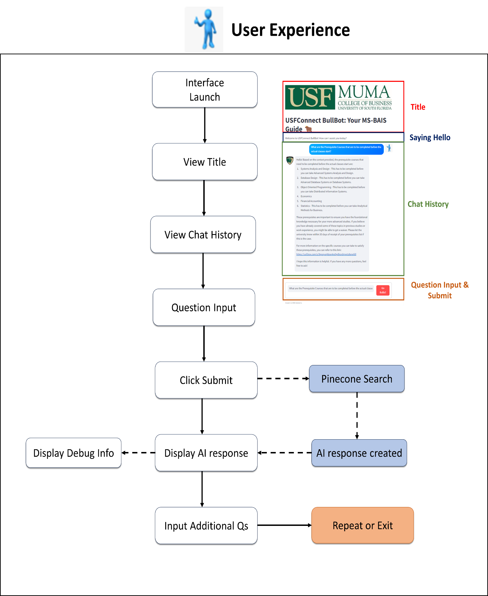

Figure 9- User Experience Flow

# Enhancing User Experience with an Integrated Feedback System

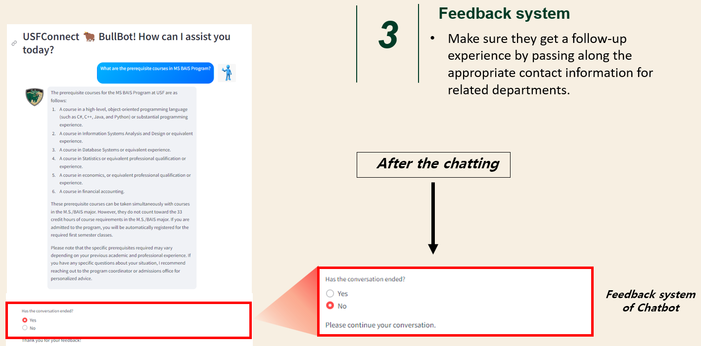

*Figure 10- User Experience*

To continuously refine the USFConnect Chatbot's performance and user
satisfaction, we have implemented an integrated feedback system within
the chat interface. After engaging with BullBot, users are prompted to
indicate whether their conversation has concluded. This prompt is a
critical component of our post-interaction phase, ensuring users have
the opportunity to provide feedback or continue the dialogue as needed.

Additionally, the feedback system is designed to offer follow-up support
by providing contact information for related departments, facilitating a
comprehensive user journey that extends beyond the chat session. This
ensures that any remaining queries are directed to the appropriate
channels, fostering a complete support experience.

# Technologies and Frameworks used for the UI

The interface of the USFConnect Chatbot is the result of a carefully
crafted integration of modern technologies and frameworks, ensuring a
user experience that is not only friendly and engaging but also
reflective of the USF brand's identity.

**Streamlit Integration:**

At the heart of our interface is Streamlit, a dynamic framework that
transforms Python scripts into interactive web applications. Streamlit's
diverse array of widgets and APIs supports the chatbot's
functionalities, including chat inputs, document uploads, and
interactive feedback mechanisms. The simplicity of Streamlit's
deployment and development process enables rapid prototyping and
iteration, which is invaluable in the fast-paced evolution of our
chatbot.

**Custom CSS Styling:** To achieve a unique and consistent look that
aligns with the USF brand, custom CSS is integrated within our Streamlit
application. This layer of customization allows us to fine-tune the
presentation of UI elements, from headers and buttons to chat bubbles,
creating an interface that is both visually compelling and intuitive for
users.

**HTML Integration:** Beyond Streamlit and CSS, we employ HTML to
introduce a higher level of customization and interactivity in the UI.
Through HTML, we incorporate custom content blocks, interactive
elements, and multimedia integrations that enhance the functionality and
aesthetic appeal of the chatbot.

**Responsive Design:** Recognizing the importance of accessibility
across various devices, our UI design is responsive, ensuring
compatibility and functionality whether users access the chatbot on a
desktop computer, tablet, or smartphone. This responsive nature
guarantees that all users, regardless of their device choice, can
interact with the chatbot with equal ease and efficiency.

Together, these technologies form the foundation of a UI that is not
just intuitive and beautiful but also upholds the high usability
standards expected by the USF community.

# Workflow Schema for Prerequisite Course Verification

*Figure 11-Schema for pre-requisite check*

The diagram above illustrates the streamlined process within the
USFConnect Chatbot application that enables users to verify the
prerequisites for courses they are interested in. This feature is
integral to assisting students in navigating course requirements
efficiently. Here’s how the process unfolds:

1.  **Course Selection:** Users initiate the process by selecting a
    course within the app, indicating which subject's prerequisites they
    need to check.

2.  **Document Upload:** The user is prompted to upload documentary
    evidence, such as a bachelor's syllabus or an experience
    certificate, in PDF format. This step ensures that the chatbot has
    all the necessary information to make an informed evaluation.

3.  **Relevant Prompt Generation:** Utilizing the uploaded documents,
    the system generates relevant prompts. This is achieved by
    referencing a pre-established database of course-based information
    alongside a set of instructions tailored to the task.

4.  **LLM Processing:** The generated prompt is processed using a Large
    Language Model (LLM), specifically OpenAI's GPT-3.5 Turbo. The LLM
    assesses the query against a vast repository of educational data and
    criteria.

5.  **Results Display:** Finally, the chatbot displays the results to
    the user, detailing whether the prerequisites for the selected
    course are met based on the analysis. This ensures users receive all
    necessary information to understand their eligibility or what
    further steps they may need to take.

This schema is a visual representation of the application's capability
to streamline the prerequisite checking process, thereby enhancing the
user experience and providing immediate, valuable feedback to
prospective students.
